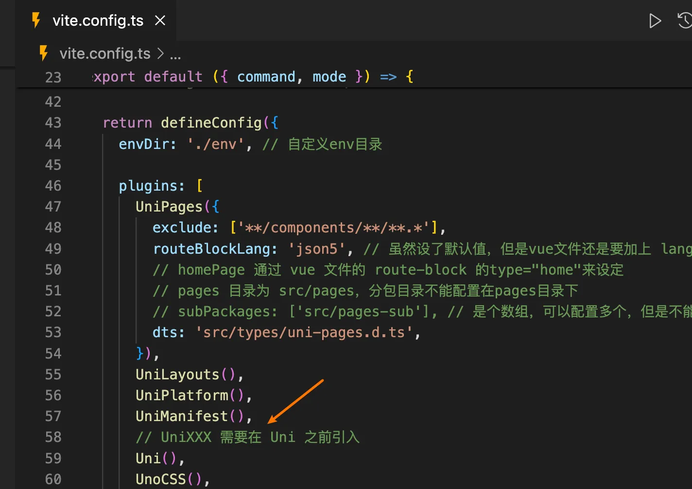

# uni 插件

## 引言

有群友第一次看到 `unibest` 里面 `vue` 文件 `route-block` 这种写法，表示很奇怪，从来没见过！

```vue
<route lang="json5">
{
  layout: 'demo',
  style: {
    navigationBarTitleText: '标题',
  },
}
</route>

<template>
  <view class="text-green-500">菲鸽，你好，我喜欢你！</view>
</template>
```

## uni 插件总览

哈哈，这个当然是 `uni插件` 的功劳了，具体点是 `@uni-helper/vite-plugin-uni-pages` 插件的功劳，该插件由 `uni-helper` 官方团队开发。

本文就来说说 `unibest` 都引入了哪些有用的 `uni插件`。下面这个表格描述了各个插件的主要作用。

|                插件名                | 作用                                                                                                                                                                                  |
| :----------------------------------: | :------------------------------------------------------------------------------------------------------------------------------------------------------------------------------------ |
|      @dcloudio/vite-plugin-uni       | **最核心的 `uni 插件`**，没有它就不能在 vite 项目跑 uniapp，其他所有的 `uni插件` 都需要经通过它的手来编译，所以写法上，都是先写 `UniXXX`，再写 `Uni`，见下文                          |
|  @uni-helper/vite-plugin-uni-pages   | `uni 插件`，也是 `unibest 灵魂插件`，`route-block` 就是它的功劳，让你可以直接在本文件就能设置页面的路元信息，无需跑去 `pages.json` 配置，同时支持 `pages.config.ts` 编写 `pages.json` |
| @uni-helper/vite-plugin-uni-layouts  | `uni 插件`，支多种 `layouts` 布局，群友脑洞大开，充分利用这个特性实现平时不容易实现的布局                                                                                             |
| @uni-helper/vite-plugin-uni-manifest | `uni 插件`，支持 `manifest.config.ts` 编写 `manifest.json`                                                                                                                            |

`UniXXX()` 插件都需要在 `uni()` 之前引入，因为最终都需要 `Uni` 来处理所有的代码。如下图：


接下来介绍一下 `uni 插件`，其他 `通用插件` 大家都比较熟悉，不再赘述。

`unibest` 引入了 `uni-helper` 团队的几个重要插件，少了它们 `unibest` 就缺少了灵魂，感谢 `uni-helper` 团队的贡献。`Uni 插件` 列表如下：

- `vite-plugin-uni-pages`

  - 介绍：为 `Vite` 下的 `uni-app` 提供基于文件系统的路由
  - 额外：使用 `TypeScript` 来编写 `uni-app` 的 `pages.json`
  - 访问地址：[@uni-helper/vite-plugin-uni-pages](https://github.com/uni-helper/vite-plugin-uni-pages)

- `vite-plugin-uni-layouts`

  - 介绍：为 `Vite` 下的 `uni-app` 提供类 `nuxt` 的 `layouts` 系统
  - 访问地址：[@uni-helper/vite-plugin-uni-layouts](https://github.com/uni-helper/vite-plugin-uni-layouts)

- `vite-plugin-uni-manifest`

  - 介绍：使用 `TypeScript` 来编写 `uni-app` 的 `manifest.json`
  - 访问地址：[@uni-helper/vite-plugin-uni-manifest](https://github.com/uni-helper/vite-plugin-uni-manifest)

## vite-plugin-uni-pages

得益于 [@uni-helper/vite-plugin-uni-pages](https://github.com/uni-helper/vite-plugin-uni-pages)，约定式路由（文件路由）的实现轻而易举。

`src/pages` 目录下的每个文件都代表着一个路由。要创建新页面，只需要在这个目录里新增 `.vue` 文件，插件会自动生成对应的 `pages.json` 文件。

`route` 代码块则可以配置页面相关信息，这些信息会自动同步到 `page.json`，无需切换到 `page.json` 进行配置。

> `pages.json` 文件是自动生成的，请不要手动修改，全局的东西请在 `pages.config.ts` 里面配置，页面上的东西请在 `vue` 文件的 `route` 代码块配置，如下图。

```vue [src/pages/index.vue]
<!-- 使用 type="home" 属性设置首页，其他页面不需要设置，默认为page -->
<!-- 推荐使用json5，更强大，且允许注释 -->
<route lang="json5" type="home">
{
  style: {
    navigationStyle: 'custom',
    navigationBarTitleText: '首页',
  },
}
</route>
<template>
  <div>
    <h1>欢迎使用 unibest</h1>
    <h4>unibest 是最好的 uniapp 开发模板</h4>
  </div>
</template>
```

```vue [src/pages/about.vue]
<route lang="json5">
{
  style: {
    navigationBarTitleText: '关于',
  },
}
</route>
<template>
  <view>
    <view>通过 `/pages/about` 来访问这个页面</view>
  </view>
</template>
```

### 设置首页

通过在 `route-block` 里面配置 `type="home"` 即可，尽量保证一个项目 `只有一个` 这个配置，如果有多个，会按照字母顺序来排列，最终可能不是您想要的效果。

### 设置 pages 过滤和分包

- 过滤：默认 `src/pages` 里面的 `vue` 文件都会生成一个页面，如果不需要生成页面可以对 `vite.config.ts` 中的 `UniPages` 进行 `exclude` 配置。

- 分包：如果需要设置 `分包` 则可以通过 `subPackages` 进行配置，该配置项是个数组，可以配置多个 `分包`，注意分包的目录不能为 `src/pages` 里面的子目录。

```ts [vite.config.ts]
UniPages({
  exclude: ['**/components/**/**.*'],
  subPackages: ['src/pages-sub'], // 是个数组，可以配置多个，但不能为 `src/pages` 里面的子目录
})
```

## vite-plugin-uni-layouts

得益于 [@uni-helper/vite-plugin-uni-layouts](https://github.com/uni-helper/vite-plugin-uni-layouts)，你可以轻松地切换不同的布局。

`src/layouts` 文件夹下的 `vue` 文件都会自动生成一个布局，默认的布局文件名为 `default` ，路径 `src/layouts/default.vue` 。

如果需要修改使用的布局，可以通过 `vue` 文件内 `route` 代码块指定需要的布局，如下示例使用 `demo` 布局。

```vue [src/pages/demo.vue]{3}
<route lang="json5">
{
  layout: 'demo',
  style: {
    navigationBarTitleText: '关于',
  },
}
</route>
```

```vue [src/layouts/demo.vue]
<template>
  <view>
    <!-- 这里可以写通用的布局，比如导航栏，tabbar等 -->
    <!-- slot里面装的就是子页面的内容 -->
    <slot />
  </view>
</template>
```

## vite-plugin-uni-manifest

得益于 [@uni-helper/vite-plugin-uni-manifest](https://github.com/uni-helper/vite-plugin-uni-manifest)，你可以使用 `TypeScript` 来编写 `manifest.json`。

> `manifest.json` 文件是自动生成的，请不要手动修改，需要配置的内容请在 `manifest.config.ts` 里面配置。

## 总结

本文介绍了 `unibest` 引入的几个重要的 `uni插件`。

如果还想了解更多信息，可以去 `uni-helper` [github 仓库](https://github.com/uni-helper) 看看。
